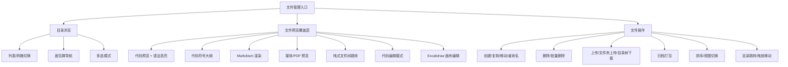
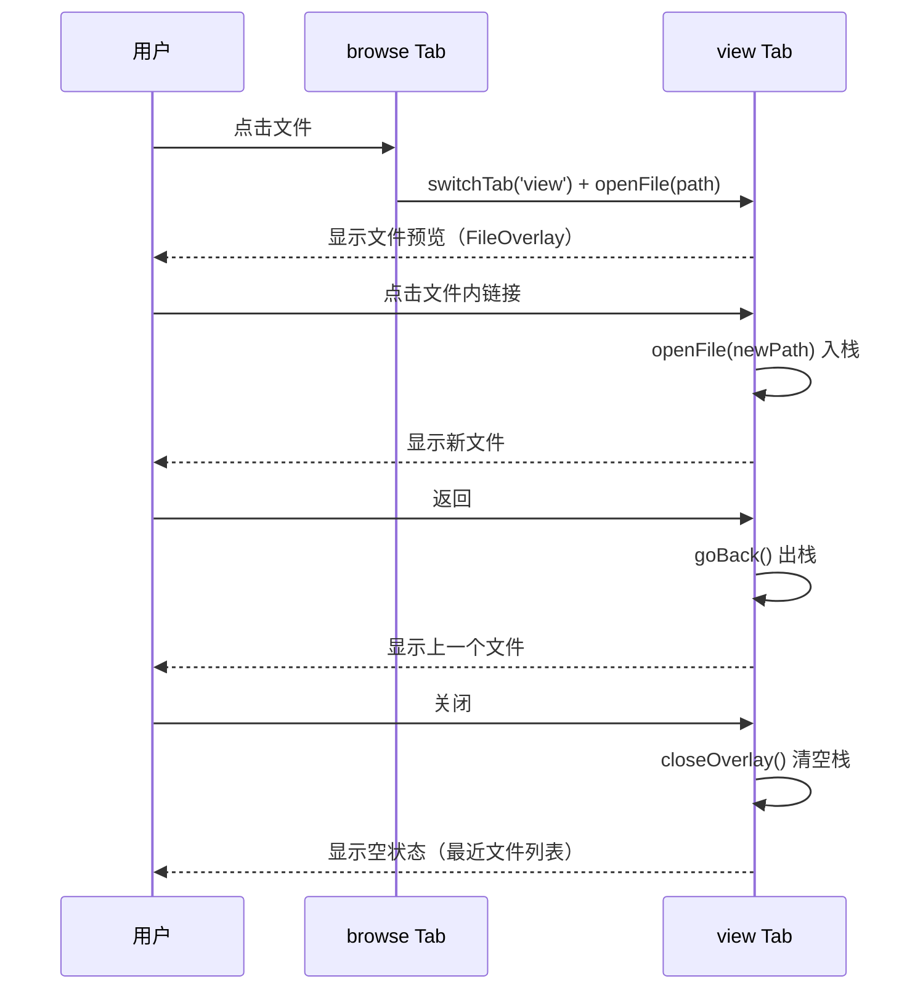
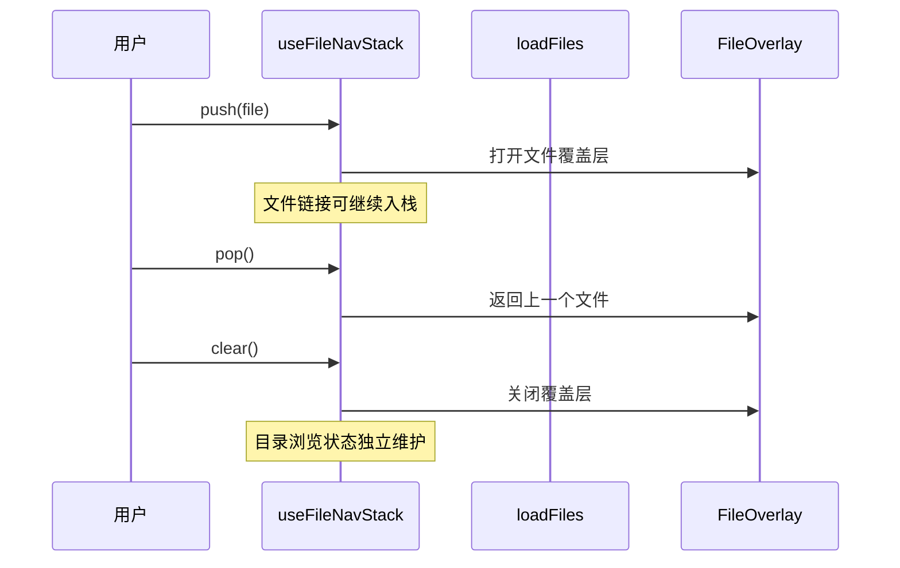
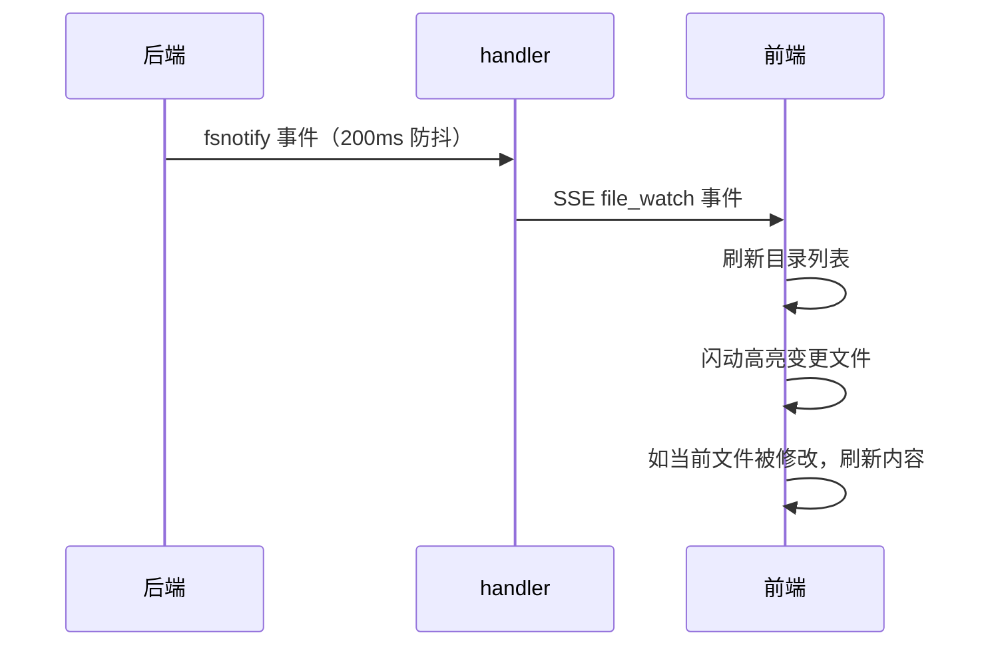

# 文件管理

文件管理让用户在 Web 界面中浏览、查看、编辑、上传项目文件——这是代码工作站的基座能力。目录浏览（`browse` Tab）和文件查看（`view` Tab）各自独立：目录浏览专注文件列表操作，文件查看以覆盖层形式展示文件内容，支持栈式导航在文件间跳转。目录浏览也采用栈式导航，支持多级目录的 push/pop/truncate 操作。文件路径标注支持双候选路径解析，优先基于当前文件目录解析，解析失败时自动回退到项目根目录。从目录浏览到代码预览，从文件上传到符号提取，覆盖了日常开发中"看代码、传文件、下归档"的核心场景。

## 流程图

### 文件操作链路

### 文件覆盖层导航

### 目录导航栈

### 文件变更监听

## 功能与设计要点

### 功能清单

- **目录浏览**：列表和网格两种视图，面包屑导航（分隔符为 `/`），支持多选操作。目录导航采用栈式模型，支持 push/pop/truncate 操作，加载失败时自动回滚到上一个状态。移动端文件浏览最基本的能力
- **目录跳转**：在文件管理器工具栏中点击定位按钮，弹出路径输入对话框，输入后直接跳转到目标目录。支持 Enter 确认和 Esc 关闭
- **文件预览覆盖层**：点击文件时切换到 `view` Tab，以覆盖层形式预览文件内容。覆盖层支持栈式导航——文件中的链接可以继续打开新文件（入栈），返回时出栈回到上一个文件，关闭覆盖层清空栈后显示空状态（最近文件列表或"打开文件管理器"按钮）
- **文件查看与编辑**：代码文件使用 CodeMirror 渲染，支持浏览/编辑双模式切换。浏览模式提供语法高亮、行号、VS Code 风格 sticky scroll（作用域定义行钉顶）和代码符号大纲；编辑模式提供 undo/redo、脏状态追踪、退出确认和语言感知的自动补全（11 种语言，基于 CodeMirror 内置补全源）。Markdown 支持渲染预览与源码编辑的标题锚定滚动同步；图片、PDF、音频（内联播放器）、视频（内联播放器）和 Office 文档使用专用预览器；OpenAPI 文件以 Swagger UI 渲染，支持"Try it out"在线测试（CORS 代理转发 API 请求绕过浏览器限制）。无法安全预览的类型回退到下载或文本模式
- **Excalidraw 画布**：`.excalidraw` 文件直接以画布编辑模式打开（无只读浏览态），通过 iframe 内嵌独立 Excalidraw 构建实现绘制与编辑。保存写回原文件，退出时检测未保存修改并确认；语言和主题跟随应用（自动发送到 iframe），与代码编辑器共享同一套脏检查保存流程
- **代码符号提取**：通过 tree-sitter（纯 Go，无 CGO）从源代码文件提取 17 种符号（class、function、method、variable 等），支持 200+ 编程语言。用户快速了解文件的结构和 API
- **Sticky Scroll**：代码浏览模式下，将当前视口外层作用域的定义行（函数/类）钉顶显示，最多 5 行。点击钉顶行可平滑滚动到定义位置。基于后端 tree-sitter 符号数据，解决长文件中上下文迷失的问题
- **文件操作**：创建、复制、移动、重命名、删除、批量删除。所有路径操作都经过 symlink 感知的穿越防护，确保不会访问项目根目录之外的文件——安全是文件操作的底线
- **文件上传**：支持多文件上传，带进度跟踪。大小和数量由配置限制（`upload.max_size_mb`、`upload.max_files`）
- **文件夹上传**：支持拖放文件夹上传，保持嵌套目录结构（包括空目录），使用 webkitGetAsEntry 递归遍历。也支持通过文件夹选择器上传
- **目录树下载**：使用 File System Access API（FileSystemDirectoryHandle）将整个目录下载到本地，保持完整目录结构。后端提供 `ServeListTree` 端点递归列出文件
- **拖放移动**：文件管理器内拖放文件/目录到目标目录，实现文件移动
- **面包屑拖拽到聊天**：宽屏模式下，面包屑的每个段（含 Home 图标）可拖拽到聊天区域附加目录路径作为上下文——与文件管理器的拖拽附件使用相同的管道，Home 图标拖拽路径为 `/`
- **粘贴上传**：Ctrl+V 粘贴剪贴板图片上传到当前目录
- **缩略图生成**：图片文件自动生成缩略图，用于列表和网格视图的预览。避免加载全尺寸图片消耗带宽
- **文件搜索抽屉**：目录浏览 Tab 内的 `FileSearchDrawer`，支持按文件名搜索、精确匹配（exact）、递归搜索（recursive）和范围切换（当前目录/全局）。搜索结果高亮匹配项，键盘上下导航，Enter 打开文件
- **排序**：按名称/时间/类型/大小排序，支持升序/降序
- **网格视图**：列表/网格切换，网格视图以缩略图展示
- **工具栏溢出**：响应式工具栏，窄屏时折叠到 More 菜单
- **文件类型图标**：根据文件扩展名显示对应的图标（代码文件、图片、音频、压缩包等），帮助用户在列表/网格视图中快速识别文件类型
- **归档打包**：选择文件/目录打包为 zip/tar 下载。移动端不方便 `tar czf`，一键打包是刚需
- **文件变更监听**：后端通过 fsnotify 监听文件变更，SSE 推送给前端，前端自动刷新目录和文件内容。用户不用手动刷新就能看到 AI 编辑的代码变化
- **刷新跳过加载遮罩**：文件管理器的刷新操作（删除、重命名、文件监听变更、tab 切换等）不显示全屏加载遮罩，内容平滑替换；仅首次打开时显示加载遮罩，给用户视觉反馈
- **文件刷新与差异高亮**：`useFileRefresh` 统一三种刷新触发（手动刷新按钮、fsnotify 自动刷新、聊天驱动刷新），保存滚动位置并高亮变更。Markdown 渲染模式使用块级差异标记（无闪烁动画），代码文件使用行级差异 + 两阶段闪烁（红色删除→蓝色新增）。编辑中文件被外部修改时弹窗确认，防止静默覆盖用户未保存的编辑。并发刷新自动去重和合并
- **文件路径标注**：聊天中和代码预览中出现的文件路径自动标注为可点击链接，点击打开文件查看器。支持双候选路径解析：优先基于当前文件所在目录（baseDir）解析相对路径，解析失败时自动回退到项目根目录解析——解决相对路径在不同上下文中可能指向不同文件的问题。外部文件路径（项目根目录之外）也可标注和打开
- **二进制文件处理**：后端检测并安全处理二进制文件。检测阶段读取前 8KB 查找 null 字节；二进制文本最多返回 64KB，并将非打印字符替换为 `.`；大文本最多返回 512KB，并在 UTF-8 边界截断。默认响应对二进制文件返回 `isBinary: true` 和空内容，前端显示占位符及“Open as text”按钮，用户确认后通过 `?forceText=1` 获取净化文本
- **Markdown 代码链接悬浮预览**：Markdown 预览模式下，鼠标悬停（hover）在验证通过的代码文件路径或 `path:line` 链接上时，延迟 250ms 弹出代码切片预览浮层卡片。支持固定（Pin/Unpin）和头部拖拽；支持最大 200 行 / 512 KiB 切片保护与超大文件（> 2 MiB）警告；触摸设备点击路径弹出 BottomSheet 抽屉；桌面端支持 Ctrl/Cmd+Click 快捷固定预览。提供 `markdownCodeLinkPreview` 本地设置开关（默认关闭），关闭时完全禁用监听并清理 8 MiB LRU 缓存
- **键盘快捷键**：Ctrl+C/X/V 剪贴板操作、Delete/Shift+Delete 删除、Ctrl+N/Ctrl+Shift+N 新建文件/文件夹、F2 重命名、Alt+Up/Backspace 上级目录、Ctrl+R/F5 刷新、Ctrl+Shift+H 显示隐藏文件、Ctrl+Shift+M/Ctrl+A 多选、Ctrl+1/Ctrl+2 列表/网格切换

### 设计要点

- **目录与文件查看独立 Tab**：`browse` Tab 专注目录浏览和文件操作，`view` Tab 专注文件内容预览。打开文件自动切换到 `view` Tab，关闭文件后停留在 `view` 显示空状态（最近文件列表 + "打开文件管理器"按钮），不自动跳回 `browse`。两个 Tab 各自独立，目录浏览状态在切换到 `view` 期间保持不变
- **栈式导航支持深度跳转**：文件内的链接（代码中的 import、聊天中标注的路径）可以继续打开新文件，所有打开的文件构成导航栈。这与浏览器的前进/后退类似，但专门为代码阅读优化
- **文件覆盖层使用导航栈**：`useFileNavStack` 管理文件预览栈。点击文件或文件内链接时入栈，返回操作出栈，关闭覆盖层清空栈；目录浏览和面包屑状态由文件管理模块独立维护
- **双候选路径解析**：文件路径标注时，相对路径同时解析出 baseDir 候选和 projectRoot 候选。标注阶段存储两个候选路径，异步验证时如果主候选不存在但备选存在，自动替换——避免因路径解析上下文不同而导致标注失效
- **路径穿越防护是 symlink 感知的**：路径校验先解析 symlink 再判断是否在项目根目录下——简单的字符串比较会被 symlink 绕过
- **fsnotify 防抖**：文件保存可能触发多个底层事件（写入、属性变更、close），防抖避免前端反复刷新
- **缩略图是按需生成的**：不预生成所有图片的缩略图，而是请求时才生成——节省存储空间，且缩略图可从原图随时重建
- **预览器按能力分流**：`FileViewer` 根据文件类型选择 `OfficePreview`、`OpenApiPreview`、`PdfPreview`、`AudioPreview`（内联播放器）、`VideoPreview`（内联播放器）、`CodeMirrorViewer`（代码浏览+编辑）或 `MarkdownPreview`；所有本地资源统一通过[本地文件服务](../infra/local-file-serving.md)加载
- **符号提取有文件大小限制**：超过 1MB 的文件跳过符号提取，避免大文件拖慢响应。Markdown 文件特殊处理，提取标题层级而非代码符号
- **CodeMirror 浏览/编辑双模式**：同一组件通过 `editable` prop 切换浏览与编辑模式。编辑模式使用特殊引用管理避免 Vue reactive proxy 破坏 CodeMirror 的 undo/redo；未保存时退出触发确认对话框。代码编辑是文件查看的自然延伸——用户看完代码后直接修改，无需切换工具
- **Markdown 标题锚定滚动同步**：在 Markdown 渲染预览与源码编辑之间切换时，通过最近 TOC 标题锚定滚动位置。标题对齐为主策略，百分比比率为降级方案——解决切换视图后丢失阅读位置的问题
- **Markdown 代码悬浮预览的单例与事件委托设计**：全屏范围内至多维持一个活动预览实例，避免多浮层重叠消耗 DOM 与内存。在 Markdown body 根节点使用事件代理监听 `mouseover`/`mouseout`/`focusin`/`focusout`/`click`，零侵入 marked 渲染产物；仅针对经过验证的 `data-path-type="file"` 目标触发预览。4 象限智能锚定（`placeNearAnchor`）结合 CSS zoom 自适应边界计算，确保任何视口尺寸与缩放比例下弹窗不溢出
- **目录树下载使用 File System Access API**：选择本地目标目录后逐文件写入，无需后端打包，支持任意大小目录
- **文件夹上传使用 webkitGetAsEntry**：递归遍历拖放的目录项，提取所有文件（含相对路径）和空目录，回退到扁平模式
